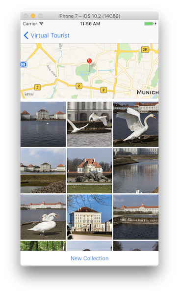

# udacity-ios-VirtualTourist

VirtualTourist is a project from the Udacity Course "iOS Persistence and Core Data":

https://www.udacity.com/course/ios-persistence-and-core-data--ud325

## Description

This app allows users to drop pins on a map and to download a photo collection from Flickr for this pin. A collection of photos is retrieved based on the longitude and latitude of the pin and a specified radius around that location.

Photos can be deleted from the photo album or a new set of photos for this album can be created.

The locations and photos are stored in Core Data. The state of the map region and span is saved in UserDefaults.

## Topics

* NSUserDefaults
* iOS File System
* Core Data Entities and Relationships
* NSFetchRequest and NSFetchResultsController
* Migrating Data Model
* Core Data and Concurrency

## User Interface

### Map View

Allows User to drop and delte pins on the map. 

### Photo Collection View

Allows the users to download and edit an album for a location.

## API Keys

The necessary Flickr API Keys is **not** included in this repository.
